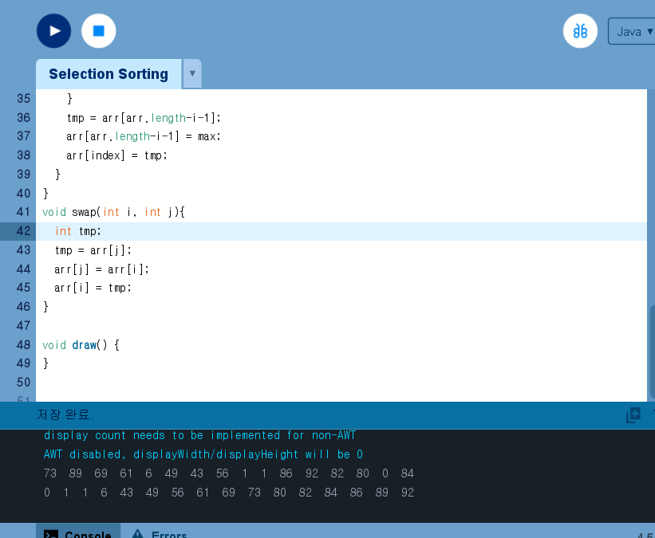
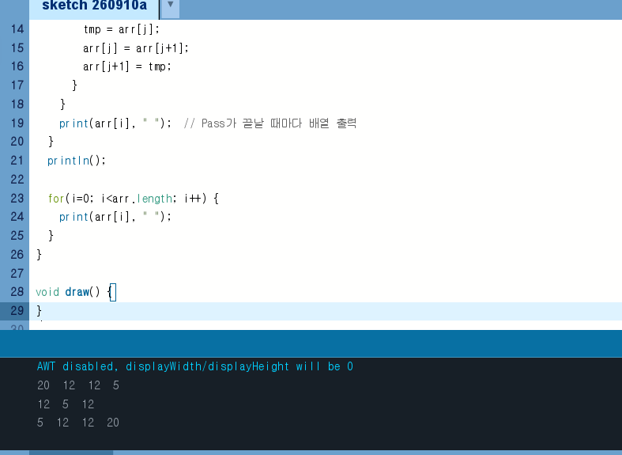

# Algorithm2026
### Homework1
<!-- 이 부분은 화면에 안 보여요 
[SelectionSorting](./homework/Selection_Sorting.pde)   
 
[Bubble](./homework/bubble.pde) 
 ///
-->
<!--| 이름 | 사진 |
|------|------|
| [SelectionSorting](./homework/Selection_Sorting.pde) |  |
| [Bubble](./homework/bubble.pde) |  |-->
| 이름 | 사진 |
|------|------|
| [SelectionSorting](./homework/Selection_Sorting.pde) |  |
| [Bubble](./homework/bubble.pde) |  |
| [HeapSort](./homework/Heap_Sort.pde) |  |
| [InsertionSort](./homework/Insertion_Sort.pde) |  |
| [MergeSort](./homework/Merge_Sort.pde) |  |
| [QuickSort](./homework/Quick_Sort.pde) |  |
